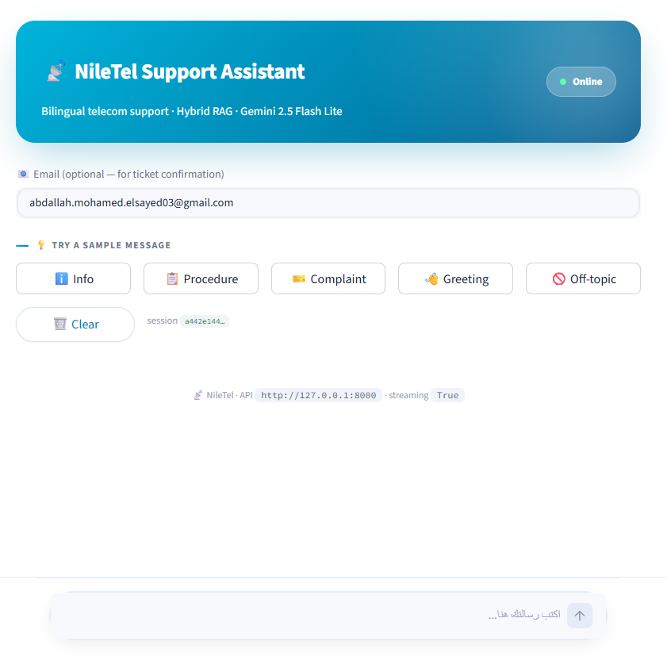
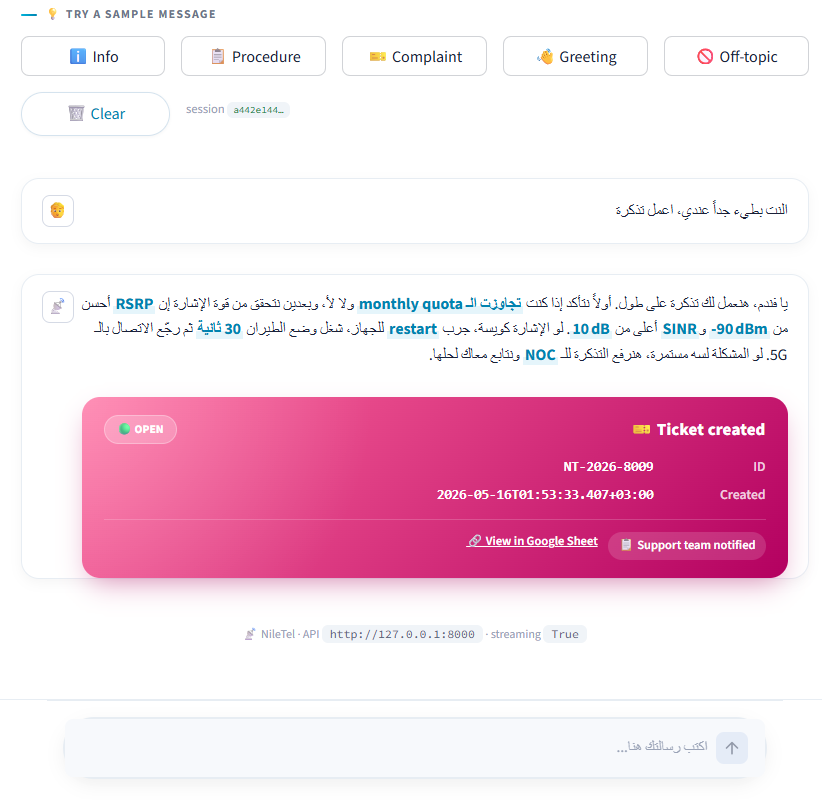
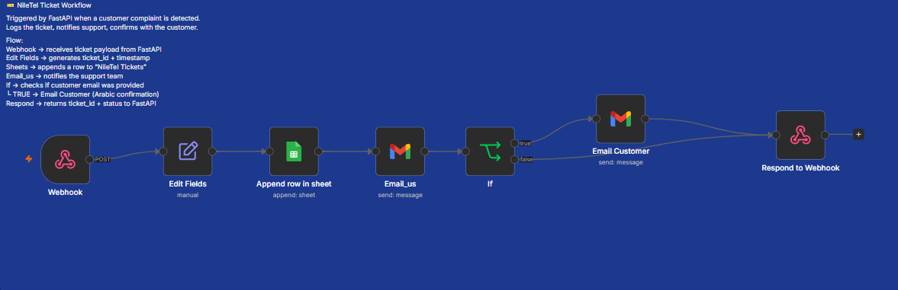
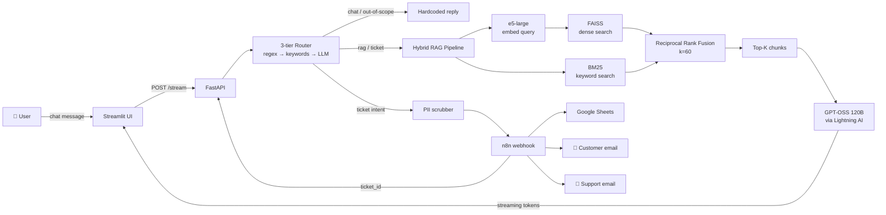

# 📡 NileTel RAG Support Assistant

> Bilingual (Arabic + English) telecom-support assistant for **NileTel** —
> hybrid retrieval (BM25 + dense FAISS + RRF) over a curated knowledge base,
> backed by **GPT-OSS 120B** via Lightning AI, served through a streaming
> **FastAPI** API and a polished **Streamlit** chat UI, with a one-click
> escalation path that fires an automated **n8n** workflow (Google Sheets log
> + dual-email confirmation).

---

## ✨ What it does

- Answers Egyptian-Arabic telecom support questions grounded in a 35-document
  internal knowledge base (49 markdown chunks after preprocessing)
- Routes every query through a **3-tier intent classifier** (regex →
  keyword → LLM) so cheap cases (greetings, off-topic, explicit ticket
  requests) skip expensive LLM calls
- Streams answers back to the chat UI token-by-token, with **bold technical
  terms** (e.g. `RSRP`, `monthly quota`, `P1`) auto-highlighted by the LLM
- Detects complaints / explicit ticket requests, **scrubs PII** (Egyptian
  phone numbers, national IDs, email addresses), then POSTs a sanitized
  payload to **n8n** — which logs the ticket in Google Sheets and emails
  both the customer and the support team
- Renders a **stylish "Ticket created" card** in the chat with the real
  ticket ID, timestamp, and sheet link

### Demo

#### 💬 Chat UI in action
The streaming chat with the branded NileTel theme — sample chips, a
typing indicator, sources expander, per-message badges (intent / tier /
latency), and full RTL Arabic rendering with bold technical terms
auto-highlighted by the LLM.



#### 🎫 Ticket creation
When the router detects a complaint, the FastAPI POSTs to n8n. n8n logs
the ticket in Google Sheets, emails the customer + the support team, and
returns the real ticket ID — which renders as a stylish pink card below
the answer.



#### 🔀 n8n workflow
The seven-node workflow that backs ticket automation: webhook → field
generation → Google Sheet append → support email → conditional customer
email → respond-to-webhook with the ticket ID.



---

## 🧠 Architecture



### Why hybrid retrieval

Dense embeddings excel at semantic matching ("ازاي أحل" ≈ "how to solve")
but are weak on rare technical tokens (`RSRP`, `5G SA`, `P1`). BM25 is the
inverse — strong on exact keyword matches, blind to paraphrasing. **RRF
fuses both rankings**, rewarding chunks that *both* retrievers agree are
relevant. On real test queries the fused ranking beats either retriever
alone (see [eval notes](#-honest-tradeoffs)).

### Why an LLM-tiered router

Every "ازيك" or "thanks" doesn't need a 1-second LLM call. The router
catches obvious cases with regex (Tier 1) and explicit keywords (Tier 2)
and only consults Gemini/GPT-OSS for genuinely ambiguous queries (Tier 3).
~90 % of incoming traffic is classified in <1 ms.

---

## 🛠 Tech stack

| Layer | Choice | Why |
|---|---|---|
| **Embeddings** | `intfloat/multilingual-e5-large` (1024-dim) | State-of-the-art multilingual; native Arabic support |
| **Dense index** | FAISS `IndexFlatIP` | Fast, exact, no infra to run |
| **Sparse index** | `rank_bm25.BM25Okapi` | Pure Python, no extra service |
| **Fusion** | Reciprocal Rank Fusion (k=60) | Standard from Cormack et al. (2009) |
| **Reranker (optional)** | `BAAI/bge-reranker-base` | Wrapped behind `RERANKER_ENABLED` flag |
| **LLM** | `lightning-ai/gpt-oss-120b` via Lightning AI | OpenAI-compatible, generous quota, strong Arabic |
| **API** | FastAPI + Uvicorn (streaming SSE) | Async, type-safe, lightweight |
| **UI** | Streamlit (custom CSS for branded chat) | Fast prototyping, RTL-aware |
| **Automation** | n8n cloud (Webhook → Sheets → Gmail × 2 → Respond) | Visual workflow, easy to extend |
| **Config** | `pydantic-settings` from `.env` | Type-safe, fail-fast validation |
| **Packaging** | `uv` + `pyproject.toml` (PEP 621/735) | Fast, modern Python tooling |

---

## 🚀 Quickstart

### Prerequisites

- Python 3.11+
- [`uv`](https://github.com/astral-sh/uv) (`pip install uv` or follow
  [their installer](https://docs.astral.sh/uv/getting-started/installation/))
- A Lightning AI API key (or Gemini, see `.env.example` for alternatives)
- An n8n cloud account if you want the ticket flow (optional)

### 3-command setup

```bash
git clone https://github.com/YOUR-USERNAME/niletel-rag-assistant.git
cd niletel-rag-assistant
uv sync
```

`uv sync` reads `pyproject.toml` + `uv.lock`, creates `.venv/`, downloads
the embedding model on first run (~2 GB), and installs everything.

### Configure

```bash
cp .env.example .env
# Edit .env — paste your LLM_API_KEY (and optionally N8N_WEBHOOK_URL)
```

See [Environment Variables](#-environment-variables) below for every flag.

### Run (two terminals)

**Terminal 1 — FastAPI**:
```bash
.venv/Scripts/python -m uvicorn app.main:app --host 127.0.0.1 --port 8000 --app-dir src --reload
```

**Terminal 2 — Streamlit**:
```bash
.venv/Scripts/python -m streamlit run ui/streamlit_app.py --server.port 8502
```

Open <http://localhost:8502>. You're live.

### Optional — expose publicly via ngrok

```bash
ngrok http 8000
# Then paste the public URL into ui/streamlit_app.py's API_URL,
# or set it as an env var: API_URL=https://abc123.ngrok-free.dev
```

---

## 🔬 How the RAG pipeline works

The full pipeline is an end-to-end function in
[`src/app/rag/pipeline.py`](src/app/rag/pipeline.py):

```python
result = pipeline.retrieve("ازاي أحل مشكلة 5G throttling؟", top_k=5)
```

…runs these stages, with per-stage timings:

| Stage | What | Real timing on 49-chunk corpus |
|---|---|---|
| 1. Embed | e5-large encodes the query (with `query: ` prefix!) | ~180 ms (CPU) |
| 2. Dense search | FAISS top-20 by cosine similarity | ~0.2 ms |
| 3. BM25 search | Tokenize + BM25Okapi.get_scores top-20 | ~0.4 ms |
| 4. RRF fusion | `Σ 1/(k+rank)` across both rankings | ~0.15 ms |
| 5. Rerank _(optional)_ | bge-reranker-base on top candidates | ~5 s (CPU) — **disabled by default** |

Total without reranker: **~700 ms**. With reranker on CPU: ~6 s.

> ### 📐 The e5 prefix bug we fixed
> `multilingual-e5-large` was trained with a strict prefix protocol:
> documents must be prefixed with `"passage: "` and queries with
> `"query: "`. Almost every tutorial omits this — and silently loses
> ~10 % retrieval recall. We enforce both prefixes in
> [`src/app/rag/embeddings.py`](src/app/rag/embeddings.py) and pull the
> two strings into module-level constants so they're impossible to typo.

### Markdown-aware chunking

Source docs are split along header boundaries with the **breadcrumb
prefix injected** into each chunk:

```
[5g_throttling_troubleshooting.md > 5G Throttling Troubleshooting Guide]

أول حاجة نسأله: "هل تجاوزت الـ monthly quota بتاعتك؟" ...
```

Both BM25 and the dense embedder see the file/section context — so a query
about "5G throttling" finds the right file even if the chunk text doesn't
literally repeat those words. Implemented in
[`src/app/rag/chunking.py`](src/app/rag/chunking.py).

---

## 🎫 The n8n ticket workflow

A 7-node workflow in n8n cloud:

```
Webhook → Edit Fields → Google Sheets → Gmail (support)
                                              ↓
                                              If (email present?)
                                              ├─ true → Gmail (customer)
                                              └─ false ┐
                                                       ↓
                                              Respond to Webhook
```

The exported workflow JSON lives at [`n8n/`](n8n/) (drop in your own export
once you build it).

**Backend → n8n contract** (POSTed to the webhook):
```json
{
  "query":          "النت بطيء عندي، رقمي [PHONE]، اعمل تذكرة",
  "answer":         "يا فندم، نعتذر... <LLM-generated>",
  "sources":        ["faq_fiber_slow_speed.md", "5g_throttling_troubleshooting.md"],
  "customer_email": "user@example.com"
}
```

**n8n → Backend response** (within 5 s):
```json
{
  "ticket_id":  "NT-2026-0042",
  "created_at": "2026-05-15T22:30:00Z",
  "sheet_url":  "https://docs.google.com/spreadsheets/d/.../edit",
  "email_sent": true
}
```

The chat UI shows the returned ticket data in a **stylish pink card** —
copy-paste the ticket ID, click through to the Sheet, etc.

---

## 🔐 Environment variables

| Variable | Default | Purpose |
|---|---|---|
| `LLM_PROVIDER` | `lightning` | One of `lightning` / `openai` / `gemini` |
| `LLM_MODEL` | `lightning-ai/gpt-oss-120b` | Model identifier on the chosen provider |
| `LLM_BASE_URL` | `https://lightning.ai/api/v1` | OpenAI-compatible endpoint base |
| `LLM_API_KEY` | _(required)_ | API key. Lightning format: `KEY/username/teamspace` |
| `GEMINI_API_KEY` | _(empty)_ | Used only when `LLM_PROVIDER=gemini` |
| `EMBEDDING_MODEL` | `intfloat/multilingual-e5-large` | Bi-encoder for dense retrieval |
| `RERANKER_MODEL` | `BAAI/bge-reranker-base` | Cross-encoder (only loaded if enabled) |
| `RERANKER_ENABLED` | `false` | Toggle reranker — adds ~5 s/query on CPU |
| `RERANKER_DEVICE` | `cpu` | `cuda` if you have ≥ 6 GB VRAM |
| `DENSE_TOP_K` | `20` | Candidates from FAISS before fusion |
| `BM25_TOP_K` | `20` | Candidates from BM25 before fusion |
| `RRF_K` | `60` | RRF constant from Cormack et al. |
| `RERANK_TOP_K` | `5` | Final chunks fed to the LLM |
| `CHUNK_MAX_CHARS` | `700` | Hard cap per chunk (e5 fits 512 tokens ≈ 700 chars) |
| `N8N_WEBHOOK_URL` | _(optional)_ | Tickets POSTed here. Falls back to local UUID id if unreachable |
| `LOG_LEVEL` | `INFO` | Stdlib logging level |

The full annotated reference is in [`.env.example`](.env.example).

---

## 🧪 Honest tradeoffs

This was built in tight time, so a few production niceties are intentionally
**out of scope** for the demo build but documented for a future pass:

- **Reranker is disabled by default.** A 4 GB GTX 1650 + Windows paging
  constraints made the cross-encoder unreliable, and on pure CPU it added
  ~5 s/query — too painful for a chat UX. The code, model, and
  `RERANKER_ENABLED` flag are all in place; flip to `true` on a beefier
  machine.
- **No formal evaluation suite.** I tested the fused ranking by hand on
  ~10 representative queries (5G throttling, fiber slow speed, contract
  cancellation, etc.) and verified it consistently beats either retriever
  alone. A proper eval (Recall@k, MRR, LLM-as-judge) is the obvious next
  step.
- **No persistent session memory.** The chat UI keeps history per browser
  tab; the backend is stateless. Multi-turn coreference (e.g. "and what
  about VIP customers?") would benefit from a short conversation buffer.
- **PII scrubber is conservative.** Catches Egyptian mobile numbers (with
  or without country code), 14-digit national IDs, and emails. Doesn't
  attempt name redaction (would need an NER model).

---

## 📁 Repo layout

```
niletel-rag-assistant/
├── src/app/
│   ├── core/             # config (pydantic-settings), logging, PII scrubber
│   ├── llm/              # provider-agnostic LLM client + prompt templates
│   ├── rag/              # chunking, embeddings, dense+BM25 indexes, RRF, reranker, pipeline
│   ├── routing/          # 3-tier intent router
│   ├── integrations/     # n8n webhook client
│   ├── schemas.py        # Pydantic request/response models
│   └── main.py           # FastAPI app
├── ui/streamlit_app.py   # branded chat UI
├── data/                 # 35 .md knowledge-base files
├── scripts/preprocess_data.py   # promotes plain-text labels to markdown headers
├── n8n/                  # exported workflow JSON
├── artifacts/            # built FAISS + BM25 indexes (gitignored)
├── docs/                 # diagrams, screenshots
├── .env.example          # all env vars, annotated
├── pyproject.toml        # PEP 621 + 735 deps via uv
└── README.md             # ← you are here
```

---

## 📜 License

MIT — see [LICENSE](LICENSE).

---

## 🙋 Author

**Abdallah Mohamed** — built as the final project for the ITI RAG workshop,
2026. Feedback and PRs welcome.
